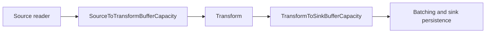

# Configuration Reference

This document describes the library-owned configuration surface used by:

- `Kuna.Projections.Core`
- `Kuna.Projections.Source.KurrentDB`

It also explains where the library stops and application-specific configuration begins.

For the shortest path to a running worker, see [quickstart.md](quickstart.md). For the broader package and runtime map, see [overview.md](overview.md). For MongoDB sink registration and persistence semantics, see [mongodb-sink.md](mongodb-sink.md).

## Configuration Shape

The libraries expect:

- `ConnectionStrings`
- one projection section per registered projection
- a nested `KurrentDB` section inside each projection section when `Source` is `KurrentDB`

The projection section name is application-defined. The tables below list the full settings surface and the default values used by the library types when a setting is present in the section but not explicitly overridden.

## `ConnectionStrings`

The library-owned names are:

- `KurrentDB`
  Required when the projection registration uses `UseKurrentDbSource(...)`.
- `PostgreSql`
  Not required by the library itself, but used by the example application when constructing the EF Core `DbContext`.
- `MongoDB`
  Not required by the library itself, but commonly used by applications and examples when passing `configuration.GetConnectionString("MongoDB")` into `UseMongoDataStore(...)`.

If `KurrentDB` is missing or empty, `UseKurrentDbSource(...)` throws during registration.

## MongoDB Sink Options

`Kuna.Projections.Sink.MongoDB` does not bind from the shared application configuration document by default. Its sink-specific settings are supplied in code through `UseMongoDataStore(connectionString, databaseName, options => ...)` or the lower-level `AddMongoProjectionsDataStore<TState>(settingsSectionName, connectionString, databaseName, options => ...)`.

That Mongo-specific options surface is documented in [mongodb-sink.md](mongodb-sink.md).

## Projection Section

Section name: application-defined

Bound by: `AddProjection<TState>(configuration, settingsSectionName: "...")`

Target type: `ProjectionSettings<TState>`

The section itself is required because `AddProjection<TState>(...)` calls `configuration.GetRequiredSection(...)`.

### Settings Summary

| Key | Type | Default | Required | Notes                                                                   |
| --- | --- | --- | --- |-------------------------------------------------------------------------|
| `InstanceId` | `string` | None | Yes | Stable deployment identity for one projection instance.                 |
| `CatchUpFlush` | `ProjectionFlushSettings` | See below | No | Flush behavior before the source reaches live processing.               |
| `LiveProcessingFlush` | `ProjectionFlushSettings` | See below | No | Flush behavior after the source catches up.                             |
| `Backpressure` | `ProjectionBackpressureSettings` | See below | No | Backpressure buffer capacities between projection pipeline stages.      |
| `Source` | `ProjectionSourceKind` | `KurrentDB` | No | Selects which source implementation the projection uses.                |
| `ModelIdResolutionStrategy` | `ModelIdResolutionStrategy` | `PreferAttribute` | No | Controls how model ids are derived from events and stream ids.          |
| `ModelStateCacheCapacity` | `int` | `10000` | No | Number of model states retained in memory.                              |
| `EventVersionCheckStrategy` | `EventVersionCheckStrategy` | `Consecutive` | No | Controls event ordering validation before `Apply(...)`.                 |

### `InstanceId`

Type: `string`

Required: yes

Meaning:

- explicit identity for one deployed projection instance
- part of the checkpoint key together with the model name
- written to projection failures and used in runtime diagnostics

Operational guidance:

- treat `InstanceId` as deployment lineage, not as a cosmetic label
- when the projection code changes and you need a full replay, deploy the new code with a new `InstanceId`
- that causes the new deployment to start from an empty checkpoint lineage and rebuild from the beginning
- keep the old deployment serving reads until the new one has caught up and been validated
- switch readers or configuration only after validation, then retire the old deployment

Examples:

- `orders-v1`
- `orders-v2`
- `orders-green-2026-05-05`

### `CatchUpFlush`

Type: `ProjectionFlushSettings`

Default:

```json
{
  "Strategy": "ModelCountBatching",
  "ModelCountThreshold": 100,
  "Delay": 1000
}
```

Used for:

- replay and catch-up processing before the source emits `ProjectionCaughtUpEvent`

Guidance:

- start with `ModelCountBatching` for replay-heavy startup
- set `ModelCountThreshold` to control count-based catch-up flush size
- `Delay` is only used when `Strategy` is `TimeBasedBatching`
- use `ImmediateModelFlush` only when lower buffering matters more than throughput

### `LiveProcessingFlush`

Type: `ProjectionFlushSettings`

Default:

```json
{
  "Strategy": "ImmediateModelFlush",
  "ModelCountThreshold": 100,
  "Delay": 1000
}
```

Used for:

- steady-state live processing after catch-up completes

Guidance:

- keep `ImmediateModelFlush` for lowest latency
- use `TimeBasedBatching` when fewer writes matter more than immediate persistence
- set `Delay` in milliseconds for `TimeBasedBatching`
- set `ModelCountThreshold` only when using `ModelCountBatching`

### `ProjectionFlushSettings.Strategy`

Type: `PersistenceStrategy`

Allowed values:

- `ModelCountBatching`
- `TimeBasedBatching`
- `ImmediateModelFlush`

Used for:

- selecting the flush strategy for `CatchUpFlush` or `LiveProcessingFlush`

Behavior:

- `ImmediateModelFlush`: flush each model change immediately
- `ModelCountBatching`: flush when distinct pending model count reaches `ModelCountThreshold`
- `TimeBasedBatching`: flush when `Delay` has elapsed

Guidance:

- use `ModelCountBatching` for catch-up throughput
- use `ImmediateModelFlush` or `TimeBasedBatching` for live processing depending on latency/write-frequency tradeoffs

### `ProjectionFlushSettings.ModelCountThreshold`

Type: `int`

Default: `100`

Used for:

- count-based flush decisions when `Strategy` is `ModelCountBatching`
- in-flight cache sizing

Guidance:

- increase it to batch more distinct models per flush
- expect higher memory use and longer replay windows as you raise it

### `ProjectionFlushSettings.Delay`

Type: `int`

Unit: milliseconds

Default: `1000`

Used for:

- time-based flush decisions when `Strategy` is `TimeBasedBatching`

Runtime behavior:

- the pipeline applies `Math.Max(1, Delay)`

Guidance:

- shorter values reduce time-based batching delay
- longer values reduce flush frequency but increase persistence latency

### `Backpressure`

Type: `ProjectionBackpressureSettings`

Default:

```json
{
  "SourceToTransformBufferCapacity": 10000,
  "TransformToSinkBufferCapacity": 10000
}
```

Used for:

- bounded backpressure buffers between pipeline stages

Pipeline flow:



#### `Backpressure.SourceToTransformBufferCapacity`

Type: `int`

Default: `10000`

Meaning:

- Akka stream buffer between source signal reading and transformation

Runtime behavior:

- the pipeline applies `Math.Max(1, SourceToTransformBufferCapacity)`
- when full, source reading is backpressured

#### `Backpressure.TransformToSinkBufferCapacity`

Type: `int`

Default: `10000`

Meaning:

- Akka stream buffer between transformation and batching/sink persistence

Runtime behavior:

- the pipeline applies `Math.Max(1, TransformToSinkBufferCapacity)`
- when full, transformation is backpressured

Guidance:

- tune from the sink backwards
- start by sizing `TransformToSinkBufferCapacity` because sink persistence is usually the controlling pressure point
- set `SourceToTransformBufferCapacity` only as large as needed to keep transform fed while sink flushes proceed

Example:

```json
{
  "Backpressure": {
    "SourceToTransformBufferCapacity": 100000,
    "TransformToSinkBufferCapacity": 10000
  }
}
```

This example intentionally allows source reading to run ahead of transformation and keeps the final buffer before sink persistence smaller. Use values this large only after measuring memory use and replay throughput.

### `Source`

Type: `ProjectionSourceKind`

Allowed values:

- `KurrentDB`

Default: `KurrentDB`

Meaning:

- selects which event source implementation the projection uses

### `ModelIdResolutionStrategy`

Type: `ModelIdResolutionStrategy`

Allowed values:

- `PreferAttribute`
- `RequireStreamId`
- `RequireMatch`

Default: `PreferAttribute`

Behavior:

- `PreferAttribute`: use `[ModelId]` when present, otherwise fall back to the stream id
- `RequireStreamId`: require the stream id to carry the model id and treat it as authoritative
- `RequireMatch`: require both stream id and `[ModelId]` to resolve and agree

Guidance:

- `PreferAttribute` is the most flexible default
- `RequireStreamId` is a good fit when stream naming is authoritative
- `RequireMatch` is the strictest option and helps catch mismatches early

### `ModelStateCacheCapacity`

Type: `int`

Default: `10000`

Meaning:

- capacity of the in-memory cache that keeps model state available after persistence succeeds

Why this exists:

- it closes the short timing gap between a successful flush and a later reload of the same model
- that avoids false missing-state or ordering issues immediately after a flush
- it avoids reloading hot models from the persistent store immediately after their runtime projection state is cleared

Runtime behavior:

- values less than `1` disable the cache

### `EventVersionCheckStrategy`

Type: `EventVersionCheckStrategy`

Allowed values:

- `Disabled`
- `Consecutive`
- `Monotonic`

Default: `Consecutive`

Behavior:

- `Disabled`: do not validate version progression
- `Consecutive`: require exact `previous + 1`
- `Monotonic`: require only that event numbers keep increasing

Guidance:

- `Consecutive` is the safest default when stream order is strict
- `Monotonic` is useful when gaps are acceptable but reordering is not
- `Disabled` should be an explicit tradeoff

## `KurrentDB`

Section name: `KurrentDB`

Bound by: `UseKurrentDbSource(...)` on a projection registration builder

Target type: `KurrentDbSourceSettings`

The section is required when the root projection setting `Source` is `KurrentDB`.

### Settings Summary

| Key | Type | Default | Required | Notes |
| --- | --- | --- | --- | --- |
| `Filter.Kind` | `KurrentDbFilterKind` | `StreamPrefix` | No | Only `StreamPrefix` is supported in the current implementation. |
| `Filter.Prefixes` | `string[]` | `[]` | Yes | Must contain exactly one non-empty prefix. |

### `Filter.Kind`

Type: `KurrentDbFilterKind`

Allowed values:

- `StreamPrefix`

Default: `StreamPrefix`

Meaning:

- selects which native KurrentDB filter shape is built
- the current implementation supports only `StreamPrefix`

### `Filter.Prefixes`

Type: `string[]`

Required: yes

Meaning:

- the single stream prefix passed to `StreamFilter.Prefix(...)`

Validation:

- exactly one prefix is required in the current implementation
- an empty array, multiple prefixes, or an empty prefix are invalid

Guidance:

- this is a prefix filter, not an exact stream-name match
- `order-` matches streams whose names start with `order-`
- system events are excluded by the implementation when constructing the native KurrentDB filter

## Application-Specific Configuration

Not every setting near projections belongs to the shared libraries.

Examples from the runnable worker:

- `ConnectionStrings:PostgreSql`
  Used by the host app when configuring `OrdersDbContext`.
- schema passed to `UseNpgsqlDataStore<TState, TDataContext>(schema: ...)`, `UseSqlServerDataStore<TState, TDataContext>(schema: ...)`, `UseMySqlDataStore<TState, TDataContext>(schema: ...)`, or `UseSqlDataStore<TState, TDataContext>(schema: ...)`
  Chosen in code, not from library-owned configuration.

Those are valid application decisions, but they are not part of the shared runtime settings contract documented above.

## When To Use A Projection-Specific Db Schema

Use a dedicated schema when:

- multiple projection modules share one physical database
- each projection module has its own `DbContext`
- you want each projection module to own its own migrations and infrastructure tables

Why this matters:

- `SqlProjectionsDbContext` includes shared infrastructure tables such as `CheckPoints` and `ProjectionFailures`
- if multiple projection contexts use the same database and schema, they can collide on both infrastructure tables and read-model tables

Schema isolation avoids that collision surface, for example:

- `orders_projection.CheckPoints`
- `orders_projection.ProjectionFailures`
- `billing_projection.CheckPoints`
- `billing_projection.ProjectionFailures`

You usually do not need a dedicated schema when:

- each projection uses its own database
- one shared `DbContext` owns all projection tables in the database

## Recommended Starting Point

For a first production-like setup, start with the library defaults and add only the KurrentDB filter:

```json
{
  "OrdersProjection": {
    "InstanceId": "orders-v1",
    "Source": "KurrentDB",
    "KurrentDB": {
      "Filter": {
        "Kind": "StreamPrefix",
        "Prefixes": [ "order-" ]
      }
    }
  }
}
```

Then tune from observed replay speed, write frequency, memory use, and operational failure patterns rather than from guesswork.

## Related Docs

- [quickstart.md](quickstart.md)
- [overview.md](overview.md)
