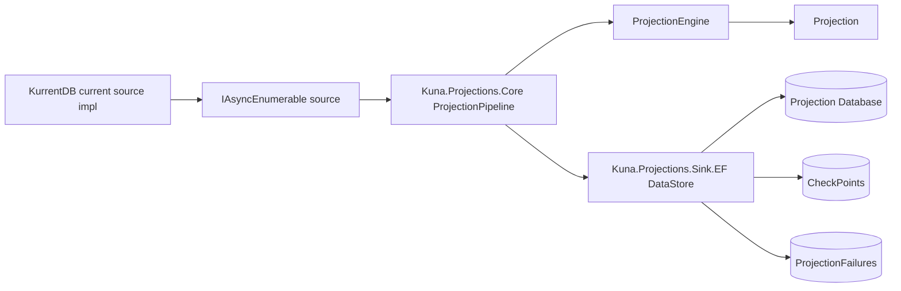
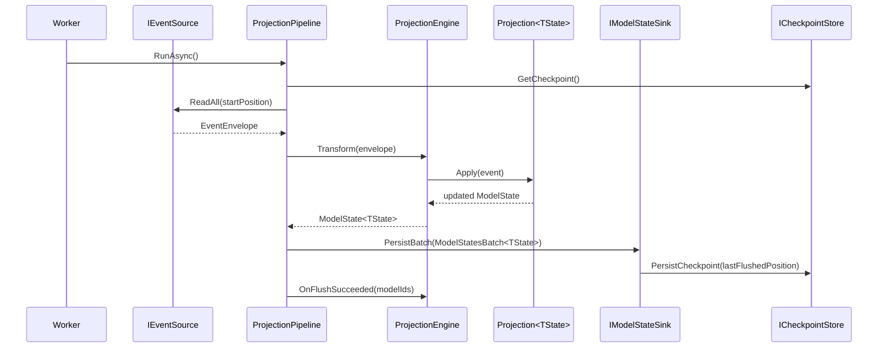

# Overview

Kuna Projections is a projection pipeline for event-sourced systems. It gives you a clear split between:

- projection behavior
- event ingestion
- persistence of read models
- operational concerns such as checkpoints and failure tracking

The intended developer experience is straightforward:

1. define a read model
2. define event types
3. implement a projection with `Apply(...)` methods
4. register the source, sink, and core runtime
5. run `IProjectionPipeline`

That is the value of the library. The application writes projection logic. The library handles event flow, replay, batching, checkpointing, and persistence.

If you want the shortest path to a running worker, start with [quickstart.md](quickstart.md). If you want every runtime setting documented, see [configuration-reference.md](configuration-reference.md).

## What The Packages Provide

- `Kuna.Projections.Abstractions`
  Contracts and shared types: events, envelopes, models, checkpoints, failures, and pipeline interfaces.
- `Kuna.Projections.Core`
  The runtime engine and pipeline that load state, apply events, batch changes, and coordinate flushes.
- `Kuna.Projections.Source.Kurrent`
  The current KurrentDB-backed implementation of the source abstraction. It reads events, deserializes them, resolves model ids, and emits envelopes.
- `Kuna.Projections.Sink.EF`
  The EF Core sink and store that persist read models, checkpoints, and projection failures.

## Why It Is Useful

For adopters, the main value is not that projections become magically simpler. It is that the repetitive plumbing moves out of the application:

- you do not write your own event-reading loop
- you do not write your own checkpoint persistence workflow
- you do not manually coordinate catch-up and live flush behavior
- you do not have to couple projection handlers directly to the current KurrentDB implementation or EF Core

That leaves the projection itself close to the language of the domain.

## Smallest Mental Model

This is the smallest accurate picture of how the libraries fit together. It omits hosting and DbContext setup on purpose.

```csharp
using Kuna.Projections.Abstractions.Models;
using Kuna.Projections.Core;
using Kuna.Projections.Sink.EF;
using Kuna.Projections.Source.Kurrent;

public sealed class Account : Model
{
    public string Email { get; set; } = string.Empty;
    public bool Verified { get; set; }
}

public sealed class AccountCreated : Event
{
    public required string Email { get; init; }
}

public sealed class EmailVerified : Event
{
}

public sealed class AccountProjection : Projection<Account>
{
    internal AccountProjection(Guid modelId)
        : base(modelId)
    {
    }

    public void Apply(AccountCreated @event) => this.My.Email = @event.Email;

    public void Apply(EmailVerified @event) => this.My.Verified = true;
}

// registration
services.AddKurrentDBSource<Account>(configuration, loggerFactory, "AccountProjection");
services.AddSqlProjectionsDataStore<Account, AccountProjectionDbContext>(schema: "dbo");
services.AddProjection<Account>(configuration, settingsSectionName: "AccountProjection");
```

Then a hosted worker resolves `IProjectionPipeline` and calls:

```csharp
await pipeline.RunAsync(stoppingToken);
```

For a full runnable example, see [examples/Kuna.Projections.Worker.Kurrent_EF.Example](../examples/Kuna.Projections.Worker.Kurrent_EF.Example), especially [Program.cs](../examples/Kuna.Projections.Worker.Kurrent_EF.Example/Program.cs), [OrdersProjection/ServiceCollectionExtensions.cs](../examples/Kuna.Projections.Worker.Kurrent_EF.Example/OrdersProjection/ServiceCollectionExtensions.cs), [OrdersProjection/OrdersProjection.cs](../examples/Kuna.Projections.Worker.Kurrent_EF.Example/OrdersProjection/OrdersProjection.cs), [OrdersProjection/OrdersDbContext.cs](../examples/Kuna.Projections.Worker.Kurrent_EF.Example/OrdersProjection/OrdersDbContext.cs), and [OrdersProjection/OrdersProjectionWorker.cs](../examples/Kuna.Projections.Worker.Kurrent_EF.Example/OrdersProjection/OrdersProjectionWorker.cs).

## Architecture

The seam lines matter more than the package list:

- source: where events come from
- projection: how a model evolves from events
- sink: where the read model and operational metadata are stored
- pipeline: how all of that is coordinated safely



## Runtime Flow

This is the important execution path from startup to persistence:



## Core Concepts

These are the concepts to understand early:

- a projection is a stateful class derived from `Projection<TState>`
- the read model is any `IModel`, usually by inheriting `Model`
- projection handlers mutate the in-memory model and the runtime updates event metadata after successful applies
- if a projection handles a terminal delete event, it should call `DeleteModel()`; the sink then physically deletes the row on flush rather than soft-deleting it
- events are CLR types derived from `Event`
- the current KurrentDB-backed source implementation discovers event CLR types from the entry assembly
- `AddProjection<TState>` requires exactly one public `Projection<TState>` for that `TState` in the assembly because discovery uses `Assembly.GetExportedTypes()` and selects with `Single(...)`
- projections are not auto-registered across the assembly; the application chooses which ones are enabled by calling `AddProjection<TState>(...)` explicitly
- checkpoints are stored separately from the read model so the pipeline can resume from the last durable position
- the EF sink also stores projection failures
- if multiple projection modules share one relational database, using separate schemas avoids collisions between their projection tables, checkpoints, and failures
- event version checks are configurable and affect replay behavior
- model id resolution in the current KurrentDB-backed source implementation can come from stream ids, `[ModelId]` attributes, or both

## Package Roles

### `Kuna.Projections.Abstractions`

This package defines the shared vocabulary used everywhere else. It is the best place to start when you want to understand the system model without reading runtime internals.

### `Kuna.Projections.Core`

This package is the runtime. It creates projection instances, reloads state, applies events, batches state changes, flushes them to the sink, advances checkpoints, and clears live in-memory state after successful flushes.

Terminal delete behavior is part of that runtime contract. A projection can mark the current model for deletion by calling `DeleteModel()` from an `Apply(...)` handler. The sink deletes the row on flush, and the pipeline intentionally does not republish deleted state into the in-memory model-state cache. The assumption is that later events for the same model are invalid and should fail because the model has been removed.

### `Kuna.Projections.Source.Kurrent`

This package provides the current KurrentDB-backed implementation of the source abstraction. It reads raw events, deserializes them into CLR types, resolves the target model id, and produces `EventEnvelope` values for the pipeline.

### `Kuna.Projections.Sink.EF`

This package provides the EF-backed sink and store. It persists model changes, loads existing state when needed for replay, stores checkpoints, and records failures for later inspection.

## Public API Map

This section is intentionally a map rather than a full type-by-type reference.

### `Kuna.Projections.Abstractions`

Core contracts:

- `IProjectionPipeline`: executable projection pipeline abstraction
- `IEventSource<TEnvelope>`: event reader abstraction
- `IModelStateTransformer<TEnvelope, TState>`: transforms an envelope into model state
- `IModelStateSink<TState>`: persists a flush of model changes
- `IModelStateStore<TState>`: loads existing state
- `ICheckpointStore`: loads and persists checkpoints
- `IProjectionFailureHandler<TState>`: records projection failures
- `IEventModelIdResolver`: resolves the target model id for an event
- `IProjectionSettings` and `ProjectionSettings`: runtime tuning knobs

Shared model types:

- `IModel` and `Model`: base shape for projection state
- `Event`: base CLR event type
- `CheckPoint`: last persisted global position for a model
- `ProjectionFailure`: persisted failure record
- `GlobalEventPosition`: position abstraction used for checkpointing
- `ProjectionCaughtUpEvent`: marker for source catch-up transition
- `ChildEntity`: base type for persisted child entities

Message types:

- `EventEnvelope`: event plus model id, stream id, event number, and creation metadata
- `ModelState<TState>`: one transformed model state change
- `ModelStatesBatch<TState>`: one persisted flush
- `UnknownEvent`: event type could not be mapped to a CLR type
- `DeserializationFailed`: raw event payload could not be deserialized

Enums and attributes:

- `PersistenceStrategy`: batching strategy selection
- `EventVersionCheckStrategy`: disabled, monotonic, or consecutive event ordering checks
- `EntityPersistenceState`: child-entity persistence tracking
- `FailureType`: failure classification
- `ModelIdAttribute`: marks the event property that carries the model id

Exceptions:

- `EventOutOfOrderException`: raised when consecutive ordering is enforced and a gap is detected

### `Kuna.Projections.Core`

Primary runtime types:

- `Projection<TState>`: base class adopters inherit to implement `Apply(...)` methods
- `ProjectionPipeline<TEnvelope, TState>`: end-to-end orchestration of reading, transforming, batching, flushing, checkpointing, and lifecycle cleanup
- `IProjectionFactory<TState>` and `ProjectionFactory<TState>`: create projections from ids or existing model state
- `IProjectionLifecycle`: lifecycle hook used by the pipeline after successful flushes
- `IModelStateCache<TState>`: in-memory state cache abstraction used between flushes and reloads

Registration:

- `ServiceCollectionExtensions.AddProjection<TState>(...)`: wires up the runtime for a model type

Important adopter notes:

- the core runtime discovers the projection type by scanning exported types and selecting the single type whose base type is `Projection<TState>`
- the projection constructor must accept a single `Guid`, which is the model id for the projection instance; this is the current shape and is expected to expand later to support other id types
- the projection base class updates event number and global event position after successful applies
- `DeleteModel()` is the projection-side API for terminal delete semantics
- `Apply(UnknownEvent)` and `Apply(DeserializationFailed)` are overridable extension points

### `Kuna.Projections.Source.Kurrent`

Source-facing types:

- `KurrentDbEventSource<TState>`: current KurrentDB-backed implementation of `IEventSource<EventEnvelope>`
- `IEventDeserializer` and `EventDeserializer`: map raw Kurrent events to CLR event types
- `IEventEnvelopeFactory` and `EventEnvelopeFactory`: build `EventEnvelope` instances
- `EventModelIdResolver`: resolves model ids from stream ids, `[ModelId]` properties, or both
- `KurrentDbHealthCheck`: verifies source connectivity
- `KurrentDbSourceSettings`: Kurrent-specific source settings
- `KurrentDbFilterSettings`: application-owned JSON shape for Kurrent subscription filters
- `ModelIdResolutionStrategy`: root projection setting that controls how stream ids and `[ModelId]` attributes are used

Registration:

- `ServiceCollectionExtensions.AddKurrentDBSource<TState>(...)`: wires the source, deserializer, resolver, envelope factory, and health check

Important adopter notes:

- event CLR types are discovered by the current KurrentDB-backed source implementation from the entry assembly by selecting exported types that inherit `Event`
- if event types live outside the entry assembly, documentation should call that out explicitly as a packaging constraint
- default model-id resolution prefers `[ModelId]`, then falls back to parsing the stream id suffix after `-`

### `Kuna.Projections.Sink.EF`

Persistence-facing types:

- `DataStore<TState, TDataContext>`: EF-backed implementation of sink, state store, and checkpoint store
- `ProjectionFailureHandler<TState, TDataContext>`: persists failures
- `IProjectionDbContext`: contract the projection DbContext must satisfy
- `SqlProjectionsDbContext`: relational base DbContext for checkpoint and failure persistence
- `CheckPointConfiguration`: EF mapping for checkpoints
- `ProjectionFailureConfiguration`: EF mapping for failures

Registration:

- `ServiceCollectionExtensions.AddSqlProjectionsDataStore<TState, TDataContext>(schema: ...)`: wires the SQL sink, store, checkpoint store, failure handler, and health check

Important adopter notes:

- the sink stores more than read models: it also stores checkpoints and projection failures
- a successful flush persists the model changes first and the checkpoint second; they are not committed as one atomic transaction
- duplicate inserts during replay are handled defensively to tolerate lag between sink writes and checkpoints

## Read Next

- [quickstart.md](quickstart.md)
- [configuration-reference.md](configuration-reference.md)
- [examples/Kuna.Projections.Worker.Kurrent_EF.Example](../examples/Kuna.Projections.Worker.Kurrent_EF.Example)
